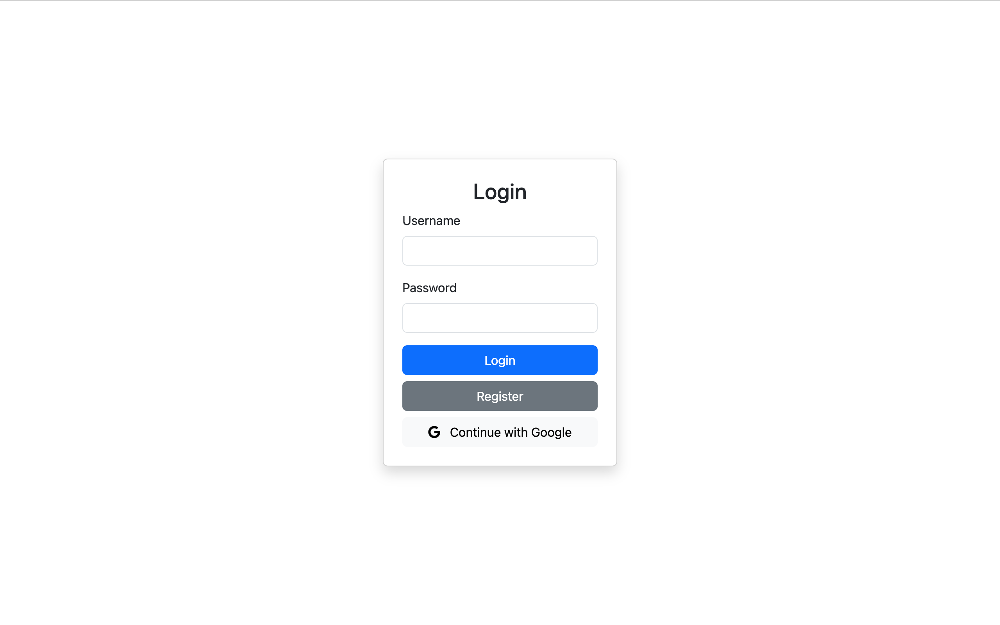
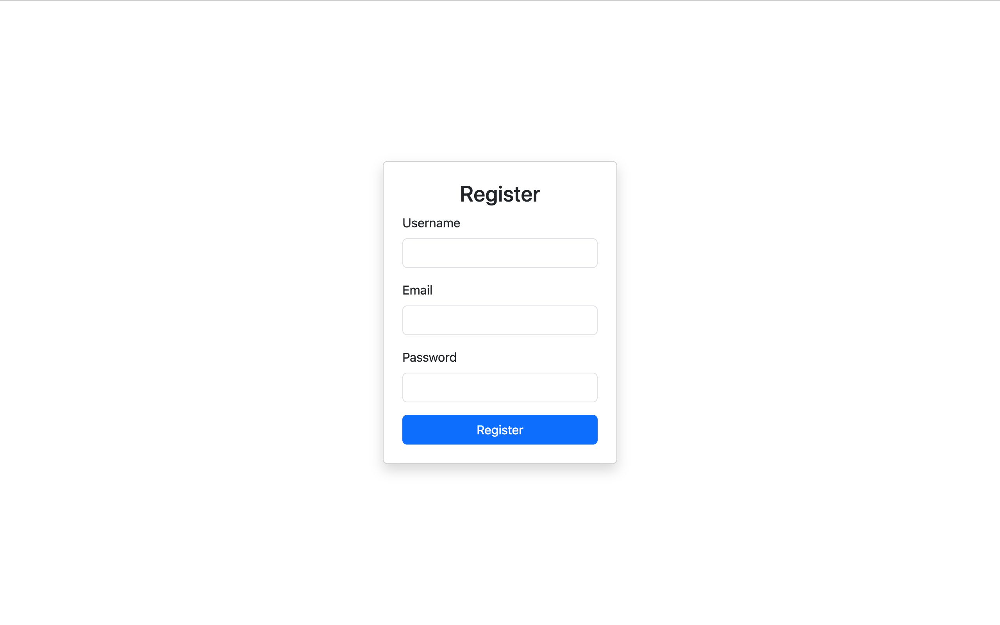
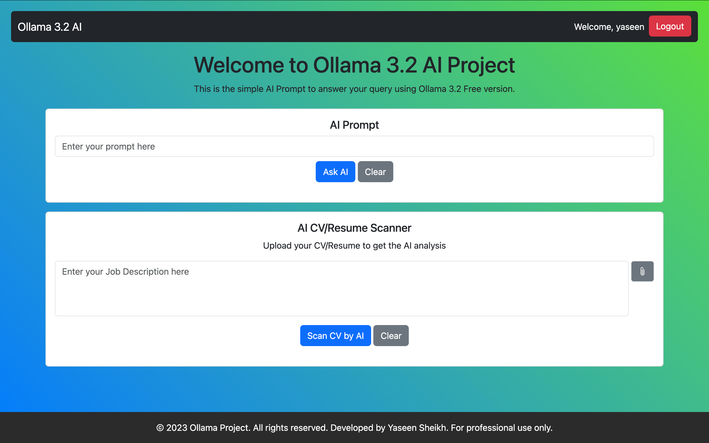

# 🤖 AI Project

## 🚀 Overview
AI is a powerful Spring Boot-based application integrating Ollama 3.2 for AI-powered chat and resume scanning. This project enables users to:

✨ Submit text prompts for AI-generated responses.
📄 Upload resumes to compare against job descriptions for suitability analysis.

## ✨ Features
- 🤖 AI-powered chat with Ollama 3.2
- 📑 Resume scanner to analyze CVs against job descriptions
- 🌐 Clean and interactive UI with HTML, CSS, and Bootstrap
- 🔗 REST API endpoints for easy integration

## 🛠 Tech Stack
- **Backend:** ⚙️ Spring Boot, Spring AI, Ollama 3.2
- **Frontend:** 🎨 HTML, Bootstrap 5, JavaScript
- **Build Tool:** 🛠️ Maven
- **Deployment:** 🛜 Deployed on Render

## 📦 Installation & Setup
1. **Clone the repository** 🛜:
   ```bash
   git clone https://github.com/MohammadYaseenSheikh/OllamaProject.git
   ```
2. **Build the project** 🔨:
   ```bash
   ./mvnw clean install
   ```
3. **Run the application** ▶️:
   ```bash
   mvn spring-boot:run
   ```

## 📡 API Endpoints
### 🔹 AI Chat
**POST** `/ai/lite`
- **Request Body:**
  ```json
  {"prompt": "Your question here"}
  ```
- **Response:**
  ```json
  {"result": "AI-generated answer"}
  ```

### 📄 Resume Scanner
**POST** `/ai/resume-scanner`
- **Request Parameters:**
  - `file`: Resume (PDF, max 5MB)
  - `job-description`: Job description text
- **Response:**
  ```json
  {"score": "your_score/10", "suggestions": "Improve your skills section.", "errorMessage":"error message if occurs"}
  ```

## 🎨 UI Preview
The project includes a modern and interactive UI with:
- 📝 AI chat interface for prompt responses
- 📂 Resume scanner with file upload and job description input

---

## 📸 Screenshots

### 🔑 Login Page


### 📝 Registration Page


### 🏠 Home Page


---

## 🚀 Future Enhancements
- ☁️ Deploy to a cloud provider
- 📊 Enhance AI analysis for better job matching
- 🔍 Improve UI with real-time response updates

## 👨‍💻 Author

👤 **Mohammad Yaseen Sheikh**  
📧 [Email](mailto:official.yaseen.sheikh@gmail.com)  official.yaseen.sheikh@gmail.com
🔗 [LinkedIn](https://www.linkedin.com/in/mohammad-yaseen-sheikh-55484915a/)  www.linkedin.com/in/mohammad-yaseen-sheikh-55484915a/

---

⭐ If you like this project, give it a **star** on GitHub! 🌟

